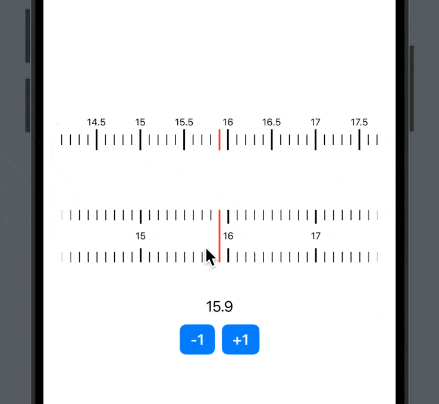

# SteppedSlider


SteppedSlider is a pure SwiftUI slider component with discrete steps, memory functionality, and a snap interaction for a smooth user experience.



## Features
- Visual indicators for step marks
- Customizable step intervals (supports both Int and Float)
- Customizable some views
- Smooth interaction with haptic feedback
- Support for SwiftUI

## Installation

### Swift Package Manager (SPM)
You can install `SteppedSlider` using Swift Package Manager.

1. Open your Xcode project.
2. Navigate to `File` → `Add Packages...`.
3. Enter the repository URL:  
```
https://github.com/shima11/SteppedSlider.git
```
4. Choose a version and add the package.

## Usage

### Example

```swift
import SwiftUI
import SteppedSlider

struct ContentView: View {

  @State private var value: Int = 2

  var body: some View {
    SteppedSlider(
      value: $value,
      range: 0...10,
      steps: 1,
      horizontalEdgeMask: .hidden,
      anchorView: {
       Rectangle()
        .frame(width: 1, height: 12)
        .foregroundColor(.red)
      },
      segmentView: { _, _ in
       Rectangle()
        .frame(width: 1, height: 12)
      },
      segmentOverlayView: { index, _ in
       Text(String(format: "%g", CGFloat(index)))
      },
      onEditing: {}
    )
  }
}
```


## Requirements
- iOS 17.0+

## License
This project is licensed under the MIT License - see the [LICENSE](LICENSE) file for details.

## Author
 [shima11](https://github.com/shima11)
